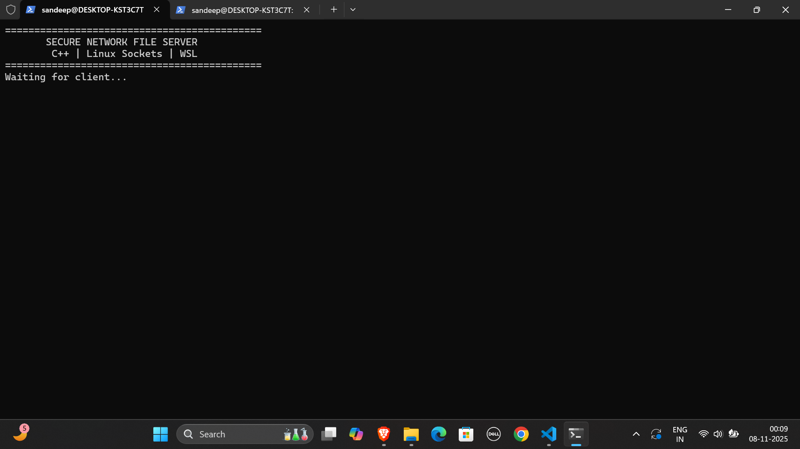
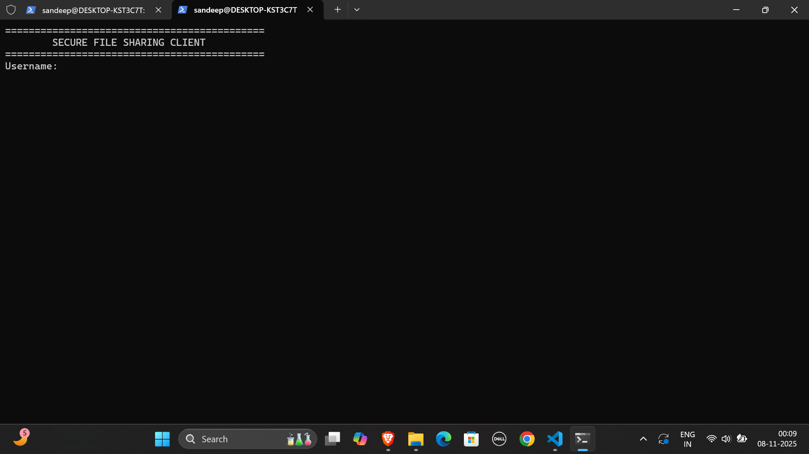
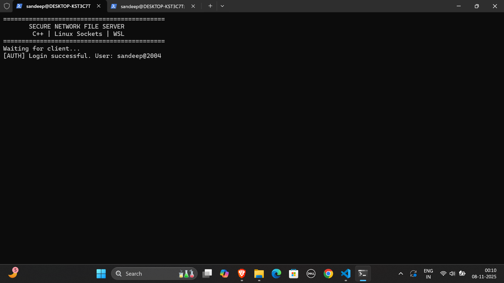
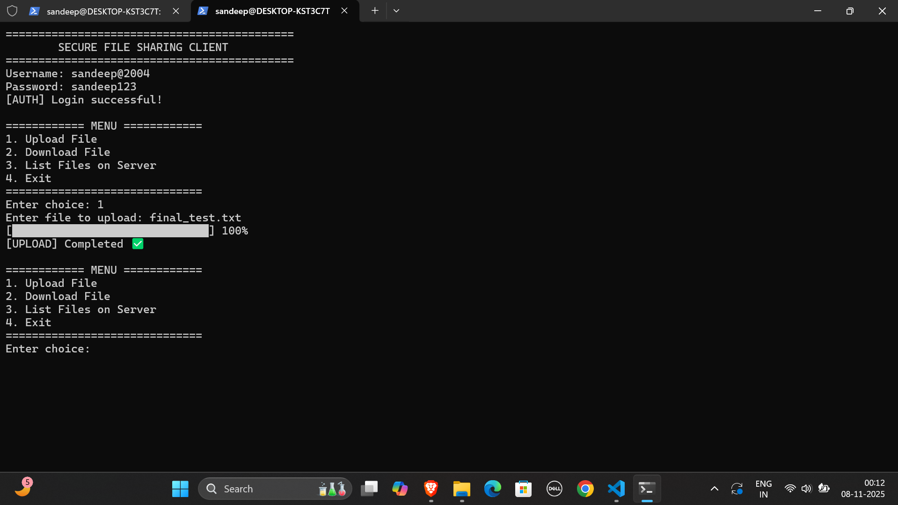
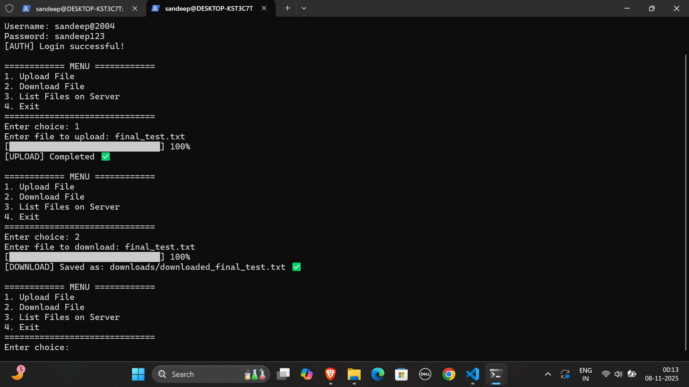
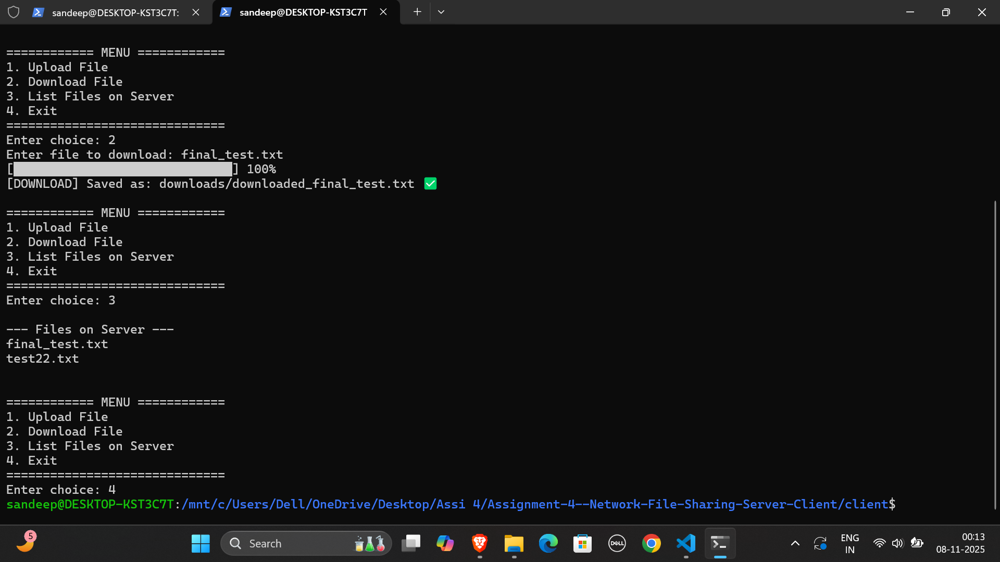
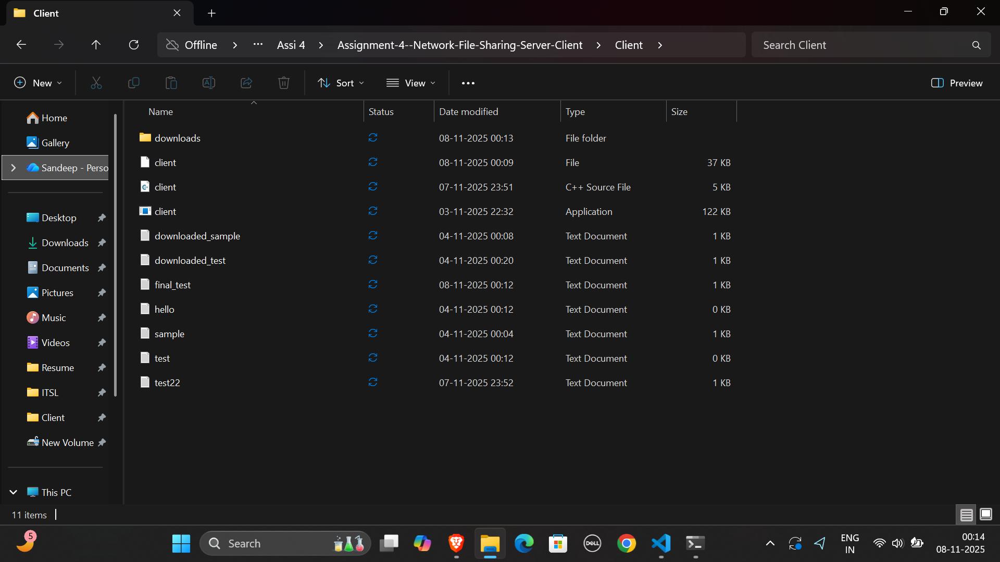
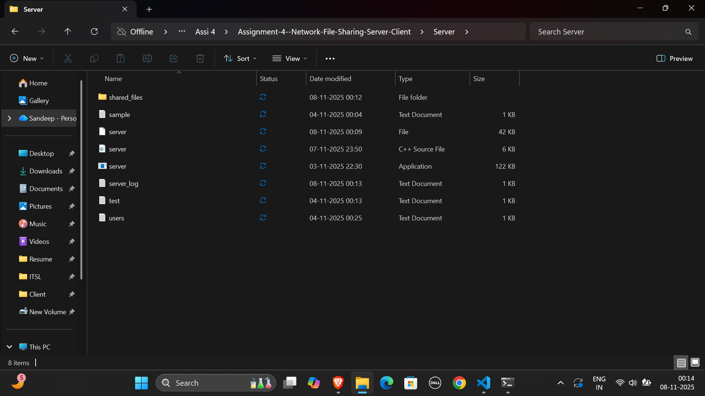
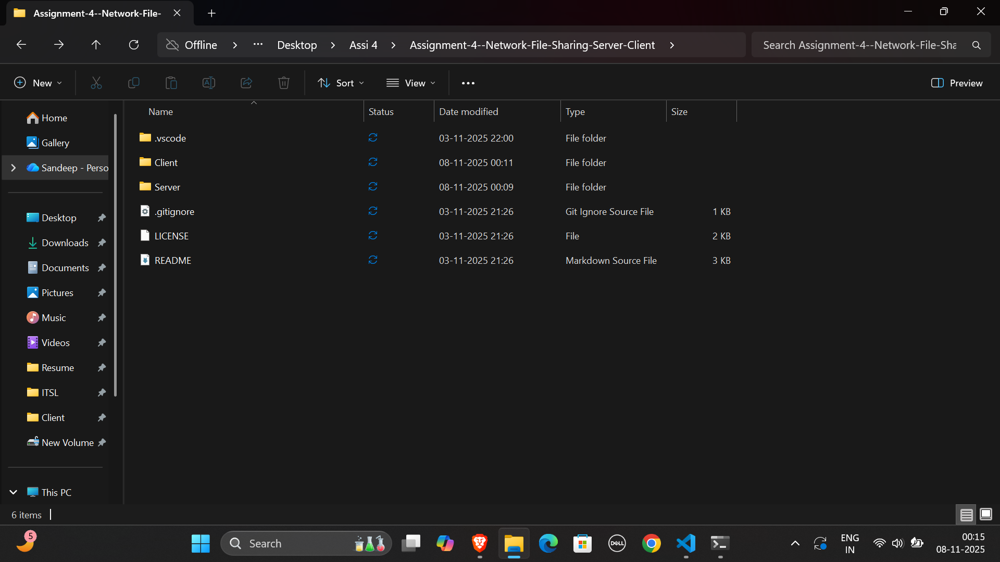

# 📁 Secure Network File Sharing System (Client–Server Model)

A secure C++ project implementing a client–server file sharing system using TCP sockets in Linux/WSL, supporting authentication, encrypted upload/download, file listing, server logging, and progress bars.

---

## ✅ 1. Project Overview

This project demonstrates a secure file-sharing mechanism where:

- Users authenticate using a username & password.
- Files can be uploaded to the server.
- Files can be downloaded from the server.
- All server files can be listed.
- XOR encryption is used for secure transfer.
- Server logs all activities in `server_log.txt`.

This project covers **Linux socket programming, encryption, client–server communication**, and **file transfer over TCP**.

---

## ✅ 2. Features

### 🔐 Authentication  
Users authenticate using credentials stored in `users.txt`.

### ⬆️ Secure File Upload  
- Encrypted file transfer  
- Chunk-based upload  
- Real-time progress bar  
- Automatic save on server  

### ⬇️ Secure File Download  
- Encrypted transfer  
- Progress bar  
- Auto-save to `/downloads/` folder  

### 📂 File Listing  
View all server files inside `shared_files/`.

### 🔒 XOR Encryption  
Simple XOR-based encryption applied during upload/download.

### 📝 Server Logging  
Every login, upload, download is logged in `server_log.txt`.

---

## ✅ 3. Folder Structure
```
Assignment-4--Network-File-Sharing-Server-Client/
├── Client/
│ ├── client.cpp
│ ├── client
│ └── downloads/
│
├── Server/
│ ├── server.cpp
│ ├── server
│ ├── users.txt
│ ├── server_log.txt
│ └── shared_files/
│
├── screenshots/
│ ├── img1.png
│ ├── img2.png
│ ├── img3.png
│ ├── img4.png
│ ├── img5.png
│ ├── img6.png
│ ├── img7.png
│ ├── img8.png
│ ├── img9.png
│ ├── img10.png
│ ├── img11.png
│ ├── img12.png
│ ├── img13.png
│ ├── img14.png
│ └── img15.png
│
├── README.md
└── LICENSE
```

## ✅ 4. How to Run

▶️ Start the Server
```
cd Server
g++ server.cpp -o server
./server
```

▶️ Start the Client
```
cd Client
g++ client.cpp -o client
./client
```

## ✅ 5. Screenshots (All 15 Included)

### 📸 1. Client Login Screen


### 📸 2. Entering Username & Password


### 📸 3. Login Successful on Client



### 📸 4. Server Authenticating User



### 📸 5. Server Login Success Message



### 📸 6. Client Main Menu


### 📸 7. Uploading File – Progress Bar



### 📸 8. Upload Completed Successfully



### 📸 9. Downloading File – Progress Bar


### 📸 10. File List on Server



### 📸 11. Download Completed


### 📸 12. Server After File Transfer Logging



### 📸 13. Client Folder Showing Downloaded Files



### 📸 14. Server Folder Showing Uploaded Files



### 📸 15. GitHub Repository Overview


## ✅ 6. Learning Outcomes
You will understand:

 1. Linux socket programming

 2. TCP client–server communication

 3. File transfer using streams

 4. Chunk-based transmission

 5. XOR encryption/decryption

 6. Logging techniques

 7. Git & GitHub workflow

 8. WSL/Linux development environment

## ✅ 7. Future Enhancements
 1. Multi-client support (threaded)

 2. AES/RSA encryption instead of XOR

 3. GUI interface

 4. SHA-256 integrity verification

 5. Pause/Resume downloads

## ✅ 8. License
MIT License.

## ✅ 9. Author
Sandeep Pattanaik
CSE(Cyber Security) Student – Network Programming Project
